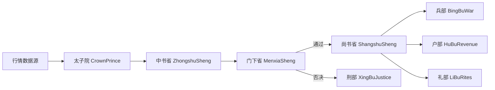

<div align="center">
  
</div>
  <h1>《Numerical Calculation of Elastohydrodynamic Lubrication》</h1>
  <p>将数值流体动力润滑程序计算的Fortran代码改写成Matlab代码，并对书中数据结果进行复现，分析</p>

## 目录

- [14.2.1](#14.2.1)
- [14.2.2](#14.2.2)
- [14.3](#14.3)
- [14.4](#14.4)

## 14.2.1

正弦粗糙度，线接触，并且用Newton–Raphson迭代求解粗糙表面EHL。

在膜厚方程中把粗糙度写成DAsin(2Πx)，叠加到光滑膜厚上。

为了避免NR迭代一开始就发散，程序在主循环中从DA=0开始逐步增大，每次都以前一次收敛解作为初值继续迭代；程序最终输出每个节点的X，压力P，膜厚H，用于画出不同DA下的曲线。随着DA增大，膜厚变化不大但压力变化很明显，且DA继续增大到一定程度会出现迭代发散。

DA等于 0，0.05，0.1，0.15的PH图如下 

- 书中Fortran代码绘制
<div align="center">
  
</div>

- Matlab代码绘制
<div align="center">
  
</div>

## 14.2.2

单个深凹坑粗糙度，线接触，Newton–Raphson。

粗糙度不再是正弦，而是一个深凹坑。

深凹坑会使局部压力计算出现趋零甚至“负压”倾向，但EHL常用假设是负压必须截断为0，当某些节点压力被置零时，要对NR线性化得到的系数矩阵对应行列进行修改（把相关行列清零、主对角置1、右端项置0一类的处理），以保证迭代仍然可解且物理约束成立。

14.2.2是在14.2.1“逐步增大粗糙度幅值以避免发散”的思路上，进一步加入了对深凹坑导致的空化/负压截断的数值处理。

- 书中Fortran代码绘制
<div align="center">
  
</div>

- Matlab代码绘制
<div align="center">
  
</div>

## 架构设计(智能体智能）

### 三省（决策主链路）

- 太子院：数据前置校验与分发
- 中书省：策略信号生成
- 门下省：风控审核与拦截
- 尚书省：执行调度与资金清算

### 六部（职能部门）

- 吏部：策略注册与生命周期管理
- 户部：现金、成本、净值核算
- 礼部：业绩报表与策略排行
- 兵部：撮合执行与交易管理
- 刑部：违规记录与风险事件
- 工部：行情清洗与指标计算

### 流程图



## 项目结构

```text
.
├─src/
│  ├─core/            # 三省核心流程
│  ├─ministries/      # 六部职能实现
│  ├─strategies/      # 内置与自定义策略管理
│  ├─strategy_intent/ # 策略意图解析与生成
│  └─utils/           # 配置、指标、数据源封装
├─data/               # 历史数据、策略库、报告数据
├─dashboard.html      # Web 面板
├─server.py           # FastAPI 服务入口
├─main.py             # 回测入口
├─run_live.py         # 实盘监控入口
└─run_backtest.py     # 命令行回测入口
```

## 快速开始

### 1. 环境要求

- Python 3.8+
- 建议使用虚拟环境

### 2. 安装依赖

```bash
pip install -r requirements.txt
pip install tushare akshare fastapi uvicorn
```

### 3. 配置说明

- 主配置：`config.json`
- 本地覆盖配置：`config.private.json`（可选）

系统会先加载 `config.json`，再自动用 `config.private.json` 进行覆盖。

`config.private.json` 示例：

```json
{
  "data_provider": {
    "tushare_token": "your_token",
    "default_api_key": "your_api_key",
    "llm_api_key": "your_llm_key",
    "strategy_llm_api_key": "your_strategy_llm_key"
  }
}
```

维护方式说明：

- 推荐直接维护 `config.private.json`，便于版本隔离与本地管理。
- 也可以在前端配置中心维护密钥字段，效果等价。
- 当前系统已实现“保存分流”：前端保存时普通配置写入 `config.json`，密钥字段写入 `config.private.json`。
- 若本地不存在 `config.private.json`，首次在前端保存密钥后会自动创建该文件。
- 自定义策略也支持“私有优先读取”：若存在 `data/strategies/custom_strategies.private.json`，系统会优先读取并写入该文件；否则回退到 `data/strategies/custom_strategies.json`。

### 4. 启动方式

回测模式：

```bash
python main.py
```

命令行回测：

```bash
python run_backtest.py --stock 600036.SH --start 2025-01-01 --end 2025-12-31 --capital 1000000
```

实盘监控：

```bash
python run_live.py
```

启动 Web 面板（实际只需要启动server，剩下的都会启动）：

```bash
python server.py
```

前台配置中心可以进行具体的配置


## 数据准备

- 本仓库默认不提供完整历史数据，`data/history/` 被 `.gitignore` 忽略，克隆后通常为空或仅少量样例。
- 若需完整回测数据，请联系仓库维护者。
- 如果你使用默认 API 数据源，系统会从 `data_provider.default_api_url` 拉取行情；若该服务不可用，回测将拿不到数据。
- 若你使用 Tushare/AkShare，可直接联网拉取，不依赖本地 `data/history` 全量文件。
- 历史差异同步功能依赖三项配置同时可用：`default_api_url`、`default_api_key`、`tushare_token`。

## 数据源与使用条件

| 数据源         | 配置项                                                                    | 使用条件                   | 典型用途         |
| ----------- | ---------------------------------------------------------------------- | ---------------------- | ------------ |
| default API | `data_provider.source=default` + `default_api_url` + `default_api_key` | 需要可访问的私有/自建行情服务        | 统一分钟线、批量回测   |
| Tushare     | `data_provider.source=tushare` + `tushare_token`                       | 需要 Tushare Token 与网络连通 | 标准化行情获取、历史补数 |
| AkShare     | `data_provider.source=akshare`                                         | 通常无需 Token，但依赖网络与上游可用性 | 快速验证、轻量使用    |

说明：

- 实盘入口 `run_live.py` 支持 `TUSHARE_TOKEN` 环境变量覆盖配置文件。
- 未提供 Tushare Token 且选择 tushare 时，会自动回退到 akshare。

#### 历史数据源表结构参照

项目根目录下：历史数据源表结构.sql文件，可自建数据库表，并自行建立API服务，供本项目调用。

## 安全基线

- 禁止将 Token / Key 写入 `config.json`
- 统一将密钥写入 `config.private.json` 或环境变量
- `.gitignore` 已忽略 `config.private.json` 与 `.env*`
- Web 面板中的密钥字段已改为密码框显示
- 配置保存会分流：普通配置写入 `config.json`，密钥字段写入 `config.private.json`
- 后端 `/api/config` 返回的密钥字段为脱敏值，请勿在公网暴露未鉴权服务

## 已知限制

- `main.py` 的回测时间区间默认写死在代码内（2024-01-01 到 2025-12-31），开箱即用但灵活性有限。
- 数据源切换依赖配置正确性，配置缺失时会出现“无有效数据，回测终止”。
- 仪表盘密钥字段为密码框，仅提供前端遮挡，不等同于后端鉴权与传输加密能力。
- 当前仓库未内置 CI 自动检查流程，提交前建议自行执行核心脚本与测试。

## Roadmap

- [x] 三省六部核心交易链路
- [x] 回测 + 实盘双模式
- [x] 策略管理与自定义策略存储
- [x] Web 配置与任务控制面板
- [ ] 更完善的 CI（测试、格式检查、发布流程）
- [ ] 更多标准化样例策略与基准报告

## 授权说明

本项目采用 **“个人非商业免费 + 商业需授权”** 模式。

**免费使用范围（非商业）**
- 个人学习
- 学术研究
- 本地自用（不对外提供商业服务）

**以下行为必须事先取得作者书面商业授权**
- 售卖本项目或衍生版本
- 托管服务、SaaS、云端收费服务
- 二次包装后销售、分销、代理
- 任何直接或间接盈利部署

**商业授权联系**
- 联系方式：`zthx410@163.com`
- 说明：商业授权范围、费用与支持条款以双方签署协议为准。


**免责声明**
- 本项目仅用于量化回测、本地数据处理与技术研究。
- 不构成投资建议，不荐股，不承诺收益。
- 使用本项目产生的一切风险（包括但不限于投资损失、数据损失、业务中断）由使用者自行承担。

> 详细条款请见仓库根目录 `LICENSE` 文件；如与商业协议冲突，以商业协议为准。


## 贡献指南

欢迎提交 Issue 和 PR。建议流程：

1. Fork 项目并创建功能分支
2. 保持提交粒度清晰，说明改动动机
3. 提交前确保核心脚本可运行
4. 通过 PR 描述测试方法与影响范围
