

  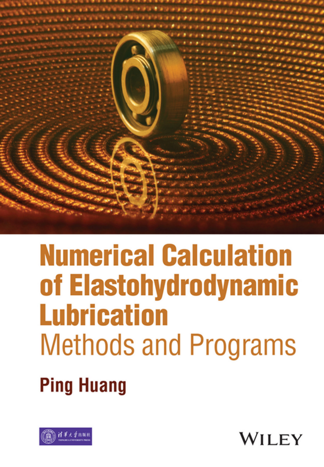

  <h1>《Numerical Calculation of Elastohydrodynamic Lubrication》</h1>
  
将数值流体动力润滑程序计算的Fortran代码改写成Matlab代码，并对书中数据结果进行复现，分析

## 目录

- [14.2.1](#14.2.1)
- [14.2.2](#14.2.2)
- [14.3](#14.3)
- [14.4](#14.4)

## 14.2.1

正弦粗糙度，线接触，并且用Newton–Raphson迭代求解粗糙表面EHL。

在膜厚方程中把粗糙度写成DAsin(2Πx)，叠加到光滑膜厚上。

为了避免NR迭代一开始就发散，程序在主循环中从DA=0开始逐步增大，每次都以前一次收敛解作为初值继续迭代；程序最终输出每个节点的X，压力P，膜厚H，用于画出不同DA下的曲线。
随着DA增大，膜厚变化不大但压力变化很明显，且DA继续增大到一定程度会出现迭代发散。

DA等于 0，0.05，0.1，0.15的PH图如下 

- 书中Fortran代码绘制

  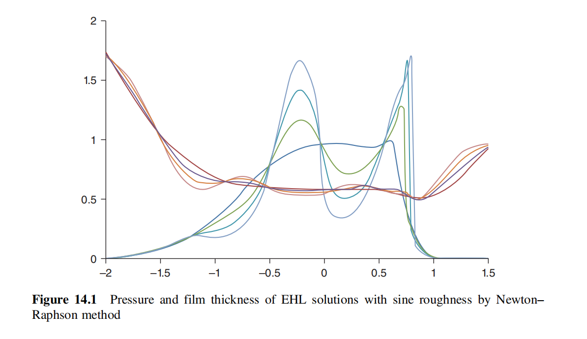

- Matlab代码绘制

  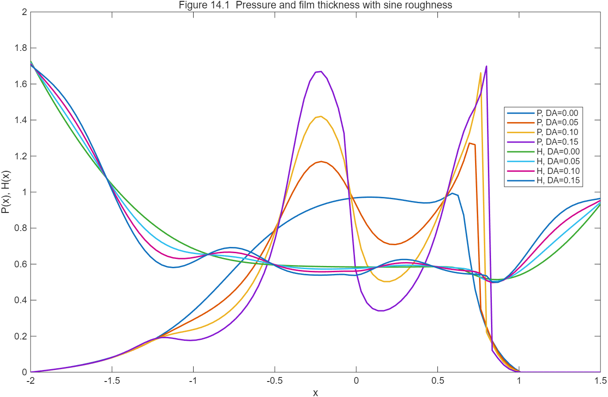

## 14.2.2

单个深凹坑粗糙度，线接触，Newton–Raphson。

粗糙度不再是正弦，而是一个深凹坑。

深凹坑会使局部压力计算出现趋零甚至“负压”倾向，但EHL常用假设是负压必须截断为0，当某些节点压力被置零时，
要对NR线性化得到的系数矩阵对应行列进行修改（把相关行列清零、主对角置1、右端项置0一类的处理），以保证迭代仍然可解且物理约束成立。

14.2.2是在14.2.1“逐步增大粗糙度幅值以避免发散”的思路上，进一步加入了对深凹坑导致的空化/负压截断的数值处理。

- 书中Fortran代码绘制

  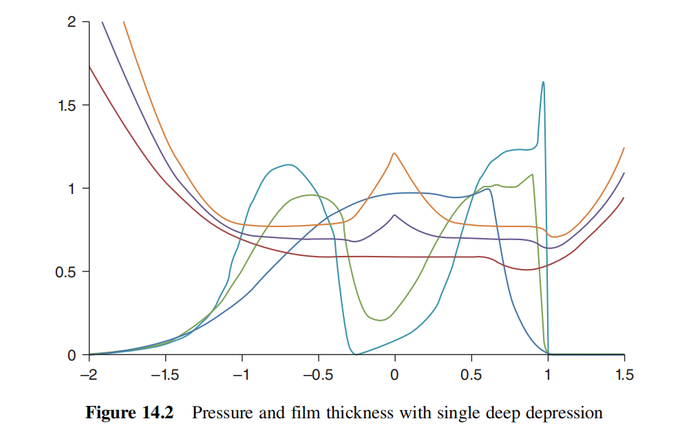

- Matlab代码绘制

  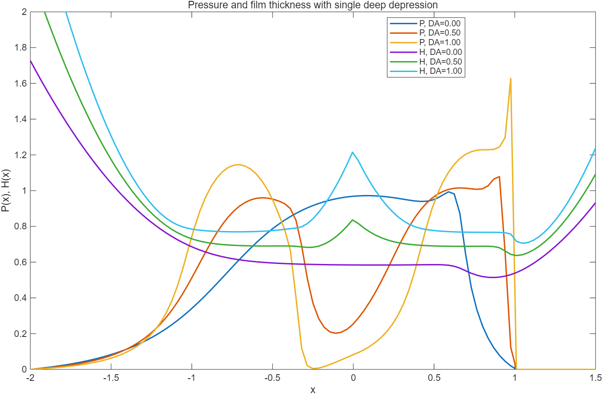

## 14.3

随机粗糙度，线接触

先用一个很小的随机数程序生成文件 ROUGH2.DAT（5000个无量纲随机数），主程序在膜厚计算的子程序中只读取一次粗糙度序列（用整数 KR 保证只读一次），
然后把该随机粗糙度乘上幅值 DA 叠加到膜厚方程中。

最终输出用于作图的数据：
（a）随机粗糙度随X的曲线。
（b）同一X轴上对应的压力分布P与膜厚H。

- 书中Fortran代码绘制

  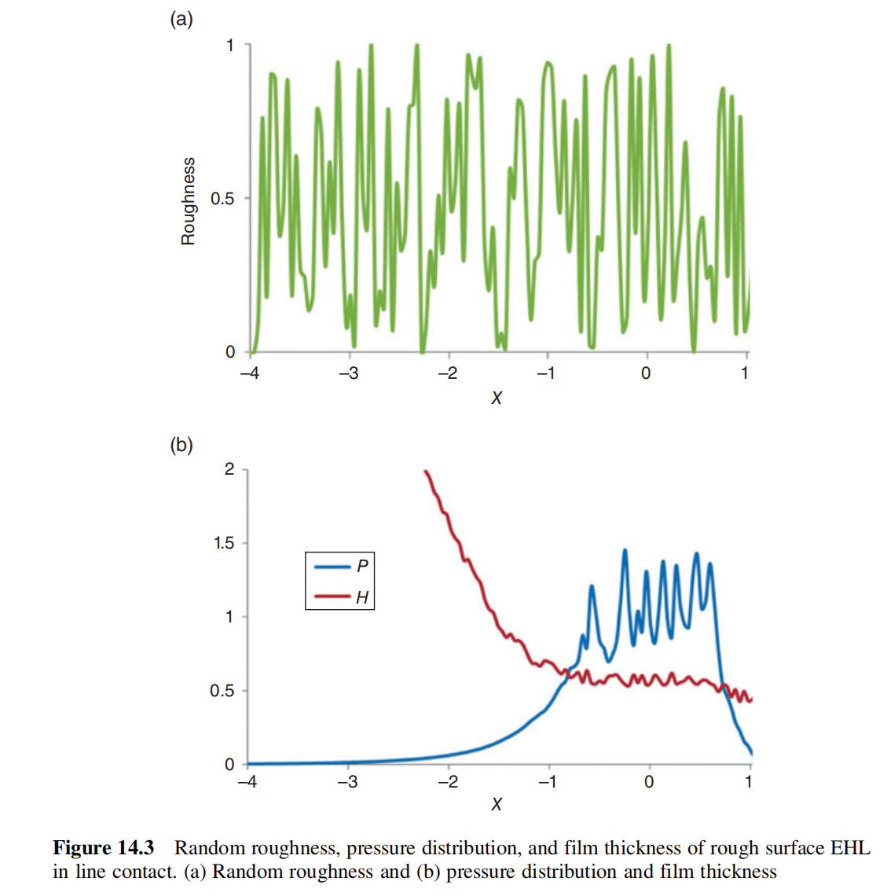

  
- Matlab代码绘制

  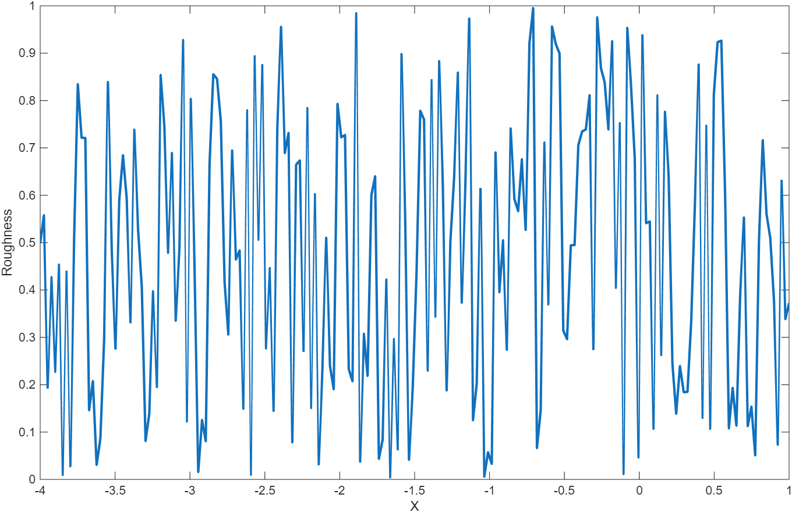

  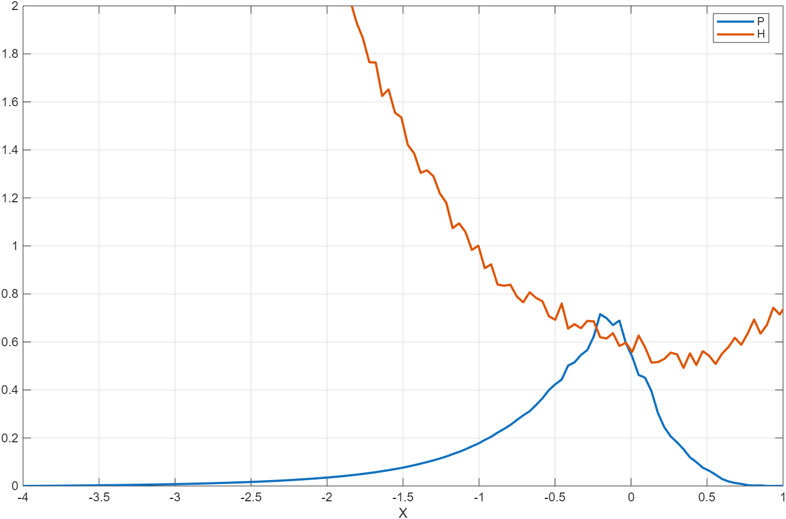

随机生成的粗糙度于原文中不一致，matlab绘制的图跟原文不一致。

## 14.4

随机粗糙度，点接触。

接触形式从线接触升级为点接触（二维）”。因此粗糙度不再是长度为节点数的一维向量，而是覆盖整个接触域的二维数组 ROU(i,j)。
代码同样采用“粗糙度提前生成并保存为 ROUGH2.DAT、主程序只读取一次、用 DA 控制粗糙度幅值并叠加到膜厚方程”。

点接触是二维问题，随机粗糙度是非对称的。输出结果为三维图：粗糙度表面、压力三维分布、膜厚三维分布。

- 书中Fortran代码绘制

  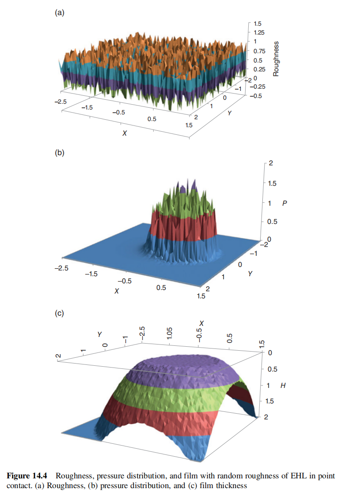

- Matlab代码绘制

  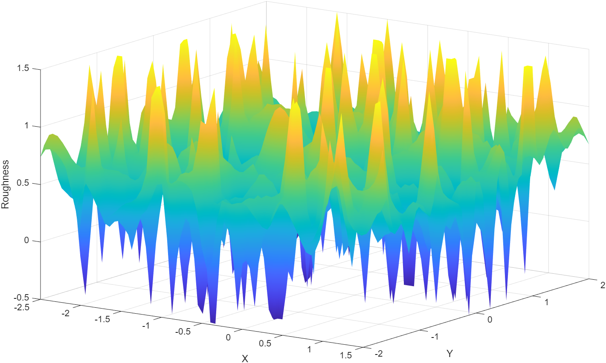

  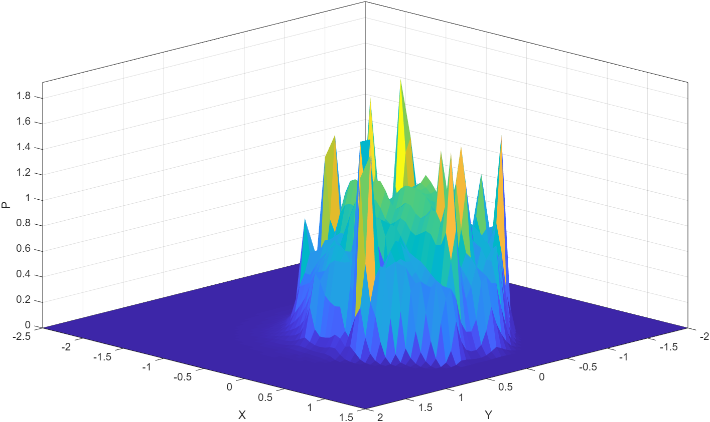

  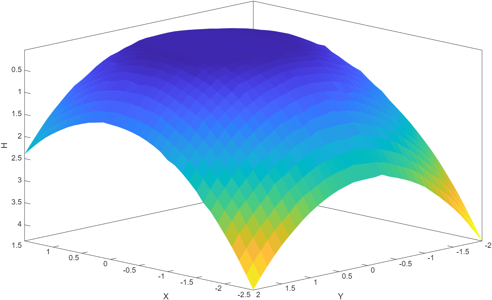

matlab绘制的图如下，随机生成粗糙度由于无法与原文保持一致，编写新的生成粗糙度的程序绘制。

